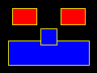
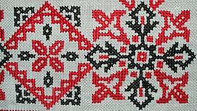

# 02 Activity: Media Computation lab

## Input/Output

### Write Programs to Draw Shapes

Here are eight lines of Python code that use pillow's "ImageDraw" module to render a smiling robot face.

```python
from PIL import Image, ImageDraw
img=Image.new('RGB', (120,90))
context=ImageDraw.Draw(img)
context.rectangle([10,50,110,80], fill='blue', outline='yellow')
context.rectangle([50,35,70,55], fill='blue', outline='yellow')
context.rectangle([15,10,45,30], fill='red', outline='yellow')
context.rectangle([75,10,105,30], fill='red', outline='yellow')
img.show()
```

Your picture viewer should show you a scary yet friendly face.

- 

The code works well enough, but it's a bit annoying for a human to read and figure out how it works. Brief comments make the code more human-friendly.

```python
from PIL import Image, ImageDraw
# prepare an image and its drawing context
img=Image.new('RGB', (120,90))
context=ImageDraw.Draw(img)

# draw robot's mouth, nose, and eyes
context.rectangle([10,50,110,80], fill='blue', outline='yellow')
context.rectangle([50,35,70,55], fill='blue', outline='yellow')
context.rectangle([15,10,45,30], fill='red', outline='yellow')
context.rectangle([75,10,105,30], fill='red', outline='yellow')

# display the result
img.show()
```

Some of the best programmers often write their comments *first*, then fill in their code as they work.

### Deeper study of this code

- A graphical image is a rectangular grid of "pixels" (picture elements). Pixels are the tiny glowing color points on a computer's monitor screen, or tiny droplets of colored ink on a printed page.
  - Compare with [*cross-stitch*](https://en.wikipedia.org/wiki/Cross-stitch), a pixel-based form of needlepoint art -- each picture element is a pair of stitches of colored floss:
  - 

Please set a breakpoint, run the program with VS Code's debugger, and step over the code as you proceed with the following study notes.

- The first line imports code from pillow's "Python Image Library" (PIL).
- The next two lines create a new "red-green-blue" (RGB) encoded picture grid that is 120 pixels wide (left to right) and 90 pixels tall (top to bottom).
  - RGB is a common way to encode color data in a digital image. It's modeled for our optical anatomy -- almost all human retinas have three distinct sensory cells stimulated by red, green or blue lights.
  - The variable named `img` references this new picture.
  - The variable named `context` references a "drawing context" that makes it easy to alter pixel colors and draw pretty shapes.
- The next lines of code place colored rectangles on the newly created image. This picutre's grid of pixels has 120 "x-coordinate" columns, numbered 0 at the viewer's left through 119 at the viewer's right, and 90 "y-coordinate" columns, numbered 0 at the top through 89 at the bottom.
  - Get used to this numbering scheme. Computers very often count starting with zero rather than one.
  - The corners of the rectangles are programmed using coordinates: `[x_left, y_top, x_right, y_bottom]`.
  - For example, the mouth's corners are programmed with `[10,50,110,80]`.
- The last line sends a `show()` message to the picture, which triggers a separate picture-viewing app that displays the finished artwork.

Such triggers are common in *event-driven* programming models. Instead of the

> INPUT >> PROCESS >> OUTPUT

pattern we follow for our terminal console programs, this program's pattern is more like

> PROCESS >> EVENT

because it doesn't output its own results. Instead it triggers an *event*, relying on another program's code to handle the finished product.

### Challenge

See if you can make the robot's face look more friendly or frightening, by drawing additional colored rectangles for other features such as eyebrows, teeth, or rosy cheeks.

---

>*Image credit: Paula Kate Marmor, Wikimedia Commons*
