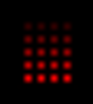

# 03 Activity: Media Computation lab

## Variables and Expressions

### Pixels with Varying Colors

Here are nine lines of Python code that use the pillow module to render a pattern of pixels with different color shades.

```python
from PIL import Image
# prepare an image and "load" its matrix of pixels
img=Image.new('RGB', (120, 90))
grid=img.load()

# draw a pattern of pixels with progressively brighter color shades
grid[40, 30] = grid[42, 30] = grid[44, 30] = grid[46, 30] = (51, 0, 0)
grid[40, 32] = grid[42, 32] = grid[44, 32] = grid[46, 32] = (51 * 2, 0, 0)
grid[40, 34] = grid[42, 34] = grid[44, 34] = grid[46, 34] = (51 * 3, 0, 0)
grid[40, 36] = grid[42, 36] = grid[44, 36] = grid[46, 36] = (51 * 4, 0, 0)
grid[40, 38] = grid[42, 38] = grid[44, 38] = grid[46, 38] = (51 * 5, 0, 0)

# display the result
img.show()
```

Run this program, then zoom in to examine the pattern of pixels.



### Deeper study of this code

Please set a breakpoint, run the program with VS Code's debugger, and step over the code as you proceed with the following study notes.

- The first line imports code from pillow's "Python Image Library" (PIL).
- The second line creates a new RGB-encoded picture, 120 pixels wide by 90 pixels tall. The variable `img` references this new picture.
- The third line of code "loads" all of the pixels from the image. The variable `grid` references the collection of pixels. Think of it as each pixel getting its very own variable somewhere in the grid's table -- `grid` keeps track of (120 × 90 = ) 10,800 different variables within itself.
- The next five lines of code change the colors of particular pixels:
  - The pixel 40 columns from the left and 30 rows down from the top is painted dark red. So are three other pixels to its right.
  - The color data is represented by three numbers between round parentheses: **(red, green, blue)**.
  - The chain of `=` assignments is just a convenient way to assign many pixels at once. The color values represent intensity levels between 0 (darkest) and 255 (brightest), giving 256 different brightness levels.
    - Again, notice that the computer counts from zero to 255, not from 1 to 256.
  - On subsequent rows, brighter shades of red are calculated with expressions that use the `*` multiplication operator.
- After coloring twenty distinct pixels, the last line sends a `show()` message to the picture, which triggers a separate picture-viewing app to display the finished artwork.

Here's a slightly modified version of the code, which changes the pattern's location and colors:

```python
from PIL import Image
# prepare an image and "load" its matrix of pixels
img=Image.new('RGB', (120, 90))
grid=img.load()

# draw a pattern of pixels with progressively dimmer color shades
grid[70, 50] = grid[72, 50] = grid[74, 50] = grid[76, 50] = (0, 255, 0)
grid[70, 52] = grid[72, 52] = grid[74, 52] = grid[76, 52] = (0, 255 // 2, 0)
grid[70, 54] = grid[72, 54] = grid[74, 54] = grid[76, 54] = (0, 255 // 3, 0)
grid[70, 56] = grid[72, 56] = grid[74, 56] = grid[76, 56] = (0, 255 // 4, 0)
grid[70, 58] = grid[72, 58] = grid[74, 58] = grid[76, 58] = (0, 255 // 5, 0)

# display the result
img.show()
```

The only differences in the modified version are the coordinate numbers, colors, and the arithmetic expressions for calculating color intensities.

### Challenges

- Try to make patterns of pixels in other colors, such as blue or yellow or burgundy.
- See if you can figure out how to make some other pattern with your pixel dots, like a diamond, a flower petal, a traffic light, or the *Ursa Major* "big dipper" star constellation.
