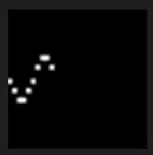
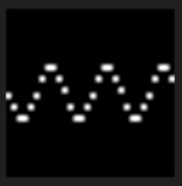

# 04 Activity: Media Computation lab

## Solving Problems Using Variables and Expressions

### Plot a Graph of a Function

Here is Python code that uses a `math` function and the pillow module to plot points of a [sine wave](https://en.wikipedia.org/wiki/Sine_wave):

```python
import math
from PIL import Image
graph=Image.new('RGB', (30, 30))
grid=graph.load()

# try to draw a graph of the math module's sine function
x = 0; y = math.sin(x); grid[x, y] = (255,255,255)
x = 1; y = math.sin(x); grid[x, y] = (255,255,255)
x = 2; y = math.sin(x); grid[x, y] = (255,255,255)
x = 3; y = math.sin(x); grid[x, y] = (255,255,255)
x = 4; y = math.sin(x); grid[x, y] = (255,255,255)
x = 5; y = math.sin(x); grid[x, y] = (255,255,255)
x = 6; y = math.sin(x); grid[x, y] = (255,255,255)
x = 7; y = math.sin(x); grid[x, y] = (255,255,255)
x = 8; y = math.sin(x); grid[x, y] = (255,255,255)
x = 9; y = math.sin(x); grid[x, y] = (255,255,255)


# display the result
graph.show()
```

Zoom in on the resulting picture. A sine wave should look wiggly, but this code just makes a short straight white line segment.


Details:

- The first four lines import the libraries, create a 30x30 pixel image named `graph`, and fetch its pixels into `grid`.
- The next ten lines plot ten points.
- Each line is actually *three* Python code statements, separated by `;` semicolons. *(Footnote [^1])*
- The x-coordinate is the column, from zero through nine. The y-coordinate is the row, computed as the sine of the corresponding column number. The pixel at that [x, y] grid coordinate is colored white.

In order to get more insight about why the plotted graph doesn't match our expectation, let's add some ***tracing*** print statements that log the coordinates as they are plotted:

<pre>
import math
from PIL import Image
graph=Image.new('RGB', (30, 30))
grid=graph.load()

# try to draw a graph of a math function
x = 0; y = math.sin(x); <span style="color: #c71f23;">print(x, y);</span> grid[x, y] = (255,255,255)
x = 1; y = math.sin(x); print(x, y); grid[x, y] = (255,255,255)
x = 2; y = math.sin(x); print(x, y); grid[x, y] = (255,255,255)
x = 3; y = math.sin(x); print(x, y); grid[x, y] = (255,255,255)
x = 4; y = math.sin(x); print(x, y); grid[x, y] = (255,255,255)
x = 5; y = math.sin(x); print(x, y); grid[x, y] = (255,255,255)
x = 6; y = math.sin(x); print(x, y); grid[x, y] = (255,255,255)
x = 7; y = math.sin(x); print(x, y); grid[x, y] = (255,255,255)
x = 8; y = math.sin(x); print(x, y); grid[x, y] = (255,255,255)
x = 9; y = math.sin(x); print(x, y); grid[x, y] = (255,255,255)

# display the result
graph.show()
</pre>

Ten print statements have been inserted to output the coordinate numbers to the terminal as they are plotted. Adding `print()` functions for tracing are sometimes used as a "quick-and-dirty" debugging tool. The terminal output helps us understand why we don't see the expected sine-wave wiggle:

```text
0 0.0
1 0.8414709848078965
2 0.9092974268256817
3 0.1411200080598672
4 -0.7568024953079282
5 -0.9589242746631385
6 -0.27941549819892586
7 0.6569865987187891
8 0.9893582466233818
9 0.4121184852417566
```

- Observe: the `math.sin()` function produces fractions between -1 and 1,
- but pixel grid coordinates are always integers, never fractions, so all of our y-coordinates get effectively truncated to zero. That's how the final graph ends up as just a humdrum horizontal line.

Let's scale and shift every computed y coordinate. The code below has been altered:

- to multiply every y-coordinate result by five, which scales those fractions out to between -5 and 5 instead of between -1 and 1,
- and also to add fifteen, which shifts the y-coordinates to between 10 and 20 insead of between -5 and 5.

<pre>
import math
from PIL import Image
graph=Image.new('RGB', (30, 30))
grid=graph.load()

# try to draw a graph of a math function
x = 0; y = math.sin(x) <span style="color: #c71f23;">* 5 + 15</span>; print(x, y); grid[x, y] = (255,255,255)
x = 1; y = math.sin(x) * 5 + 15; print(x, y); grid[x, y] = (255,255,255)
x = 2; y = math.sin(x) * 5 + 15; print(x, y); grid[x, y] = (255,255,255)
x = 3; y = math.sin(x) * 5 + 15; print(x, y); grid[x, y] = (255,255,255)
x = 4; y = math.sin(x) * 5 + 15; print(x, y); grid[x, y] = (255,255,255)
x = 5; y = math.sin(x) * 5 + 15; print(x, y); grid[x, y] = (255,255,255)
x = 6; y = math.sin(x) * 5 + 15; print(x, y); grid[x, y] = (255,255,255)
x = 7; y = math.sin(x) * 5 + 15; print(x, y); grid[x, y] = (255,255,255)
x = 8; y = math.sin(x) * 5 + 15; print(x, y); grid[x, y] = (255,255,255)
x = 9; y = math.sin(x) * 5 + 15; print(x, y); grid[x, y] = (255,255,255)

# display the result
graph.show()
</pre>

Those sine wave wiggles are a little more evident now, but the graph still seems sloppy and chaotic.


The trigonometry functions in the `math` module expect their arguments to be in *radians*, which are angle measurements based on π (***pi***, the ratio of every circle's circumference to diameter). For our next code improvement, let's use Python's `math.pi` value to scale our `math.sin()` arguments `x` to be radian-based angles:

<pre>
import math
from PIL import Image
graph=Image.new('RGB', (30, 30))
grid=graph.load()

# try to draw a graph of a math function
x = 0 <span style="color: #c71f23;">* math.pi / 5</span>; y = math.sin(x) * 5 + 15; print(x, y); grid[<span style="color: #c71f23;">0</span>, y] = (255,255,255)
x = 1 * math.pi / 5; y = math.sin(x) * 5 + 15; print(x, y); grid[1, y] = (255,255,255)
x = 2 * math.pi / 5; y = math.sin(x) * 5 + 15; print(x, y); grid[2, y] = (255,255,255)
x = 3 * math.pi / 5; y = math.sin(x) * 5 + 15; print(x, y); grid[3, y] = (255,255,255)
x = 4 * math.pi / 5; y = math.sin(x) * 5 + 15; print(x, y); grid[4, y] = (255,255,255)
x = 5 * math.pi / 5; y = math.sin(x) * 5 + 15; print(x, y); grid[5, y] = (255,255,255)
x = 6 * math.pi / 5; y = math.sin(x) * 5 + 15; print(x, y); grid[6, y] = (255,255,255)
x = 7 * math.pi / 5; y = math.sin(x) * 5 + 15; print(x, y); grid[7, y] = (255,255,255)
x = 8 * math.pi / 5; y = math.sin(x) * 5 + 15; print(x, y); grid[8, y] = (255,255,255)
x = 9 * math.pi / 5; y = math.sin(x) * 5 + 15; print(x, y); grid[9, y] = (255,255,255)

# display the result
graph.show()
</pre>

Now it finally looks more like the "hill and trough" shape of a sine-wave wiggle!



To finish up, let's remove those temporary "quick-and-dirty debug" print statement tracers, then extend the sine wave plotted points to the full width of our image. To make it easier to copy-paste lines of code, you will also see another variable `c` is introduced, to keep track of each grid column in the plot:

```python
import math
from PIL import Image
graph=Image.new('RGB', (30, 30))
grid=graph.load()

# try to draw a graph of a math function
c = 0; x = c * math.pi / 5; y = math.sin(x) * 5 + 15; grid[c, y] = (255,255,255)
c = 1; x = c * math.pi / 5; y = math.sin(x) * 5 + 15; grid[c, y] = (255,255,255)
c = 2; x = c * math.pi / 5; y = math.sin(x) * 5 + 15; grid[c, y] = (255,255,255)
c = 3; x = c * math.pi / 5; y = math.sin(x) * 5 + 15; grid[c, y] = (255,255,255)
c = 4; x = c * math.pi / 5; y = math.sin(x) * 5 + 15; grid[c, y] = (255,255,255)
c = 5; x = c * math.pi / 5; y = math.sin(x) * 5 + 15; grid[c, y] = (255,255,255)
c = 6; x = c * math.pi / 5; y = math.sin(x) * 5 + 15; grid[c, y] = (255,255,255)
c = 7; x = c * math.pi / 5; y = math.sin(x) * 5 + 15; grid[c, y] = (255,255,255)
c = 8; x = c * math.pi / 5; y = math.sin(x) * 5 + 15; grid[c, y] = (255,255,255)
c = 9; x = c * math.pi / 5; y = math.sin(x) * 5 + 15; grid[c, y] = (255,255,255)

c = 10; x = c * math.pi / 5; y = math.sin(x) * 5 + 15; grid[c, y] = (255,255,255)
c = 11; x = c * math.pi / 5; y = math.sin(x) * 5 + 15; grid[c, y] = (255,255,255)
c = 12; x = c * math.pi / 5; y = math.sin(x) * 5 + 15; grid[c, y] = (255,255,255)
c = 13; x = c * math.pi / 5; y = math.sin(x) * 5 + 15; grid[c, y] = (255,255,255)
c = 14; x = c * math.pi / 5; y = math.sin(x) * 5 + 15; grid[c, y] = (255,255,255)
c = 15; x = c * math.pi / 5; y = math.sin(x) * 5 + 15; grid[c, y] = (255,255,255)
c = 16; x = c * math.pi / 5; y = math.sin(x) * 5 + 15; grid[c, y] = (255,255,255)
c = 17; x = c * math.pi / 5; y = math.sin(x) * 5 + 15; grid[c, y] = (255,255,255)
c = 18; x = c * math.pi / 5; y = math.sin(x) * 5 + 15; grid[c, y] = (255,255,255)
c = 19; x = c * math.pi / 5; y = math.sin(x) * 5 + 15; grid[c, y] = (255,255,255)

c = 20; x = c * math.pi / 5; y = math.sin(x) * 5 + 15; grid[c, y] = (255,255,255)
c = 21; x = c * math.pi / 5; y = math.sin(x) * 5 + 15; grid[c, y] = (255,255,255)
c = 22; x = c * math.pi / 5; y = math.sin(x) * 5 + 15; grid[c, y] = (255,255,255)
c = 23; x = c * math.pi / 5; y = math.sin(x) * 5 + 15; grid[c, y] = (255,255,255)
c = 24; x = c * math.pi / 5; y = math.sin(x) * 5 + 15; grid[c, y] = (255,255,255)
c = 25; x = c * math.pi / 5; y = math.sin(x) * 5 + 15; grid[c, y] = (255,255,255)
c = 26; x = c * math.pi / 5; y = math.sin(x) * 5 + 15; grid[c, y] = (255,255,255)
c = 27; x = c * math.pi / 5; y = math.sin(x) * 5 + 15; grid[c, y] = (255,255,255)
c = 28; x = c * math.pi / 5; y = math.sin(x) * 5 + 15; grid[c, y] = (255,255,255)
c = 29; x = c * math.pi / 5; y = math.sin(x) * 5 + 15; grid[c, y] = (255,255,255)

# display the result
graph.show()
```



## Challenge

Programmers tend to be more productive troubleshooters when they use a debugger instead of temporary print() statements to trace code and observe changes in variables. Try setting a breakpoint after the `grid=graph.load()` assignment statement, then single step through the code and watch the variables change as you trace.

As we did with temporary `print()` tracers, you could even put temporary `graph.show()` statements after each plotted point, to trace the points on the grid as they appear one pixel at a time! But be aware that doing so would trigger thirty different image viewers that you'll have to close:

<pre>
# ...
c = 0; x = c * math.pi / 5; y = math.sin(x) * 5 + 15; grid[c, y] = (255,255,255)<span style="color: #c71f23;">; graph.show()</span>
c = 1; x = c * math.pi / 5; y = math.sin(x) * 5 + 15; grid[c, y] = (255,255,255); graph.show()
# ... etc. ...
</pre>

---

*Footnote*

*[^1]*: According to the official [PEP8 style guide](https://peps.python.org/pep-0008/), it's better to keep Python statements on separate lines instead of separated by semicolons. However, in these programs it helps make the repeated steps easier to read and follow. As stated at the [beginning of the guide](https://peps.python.org/pep-0008/#a-foolish-consistency-is-the-hobgoblin-of-little-minds): "know when to be inconsistent – sometimes style guide recommendations just aren’t applicable. When in doubt, use your best judgment. Look at other examples and decide what looks best."
