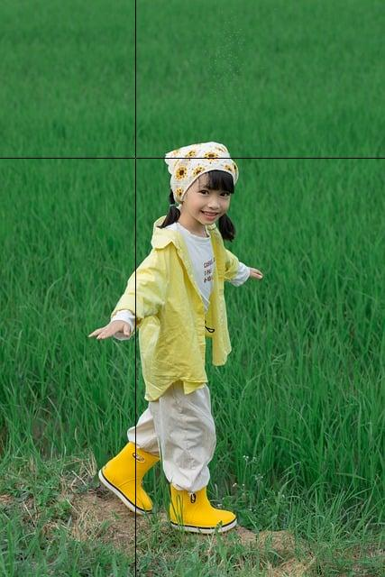

# 07 Activity: Media Computation lab

## Loops

### Examine Colors in a Picture


Here's a helpful utility for exploring pixel colors in an image. It shows the picture's size, prompts the user for coordinates, displays the picture with cross-hairs focused on those coordinates, and then outputs the RGB color values of the pixel at those coordinates.

```python
from PIL import Image;

filename = 'field.jpg'
pic=Image.open(filename)
pixel_matrix=pic.load()
(pic_width,pic_height) = pic.size

print(f'Image size (pixels): {pic_width} columns by {pic_height} rows')
query_col = int(input('x-coordinate? '))
query_row = int(input('y-coordinate? '))

# draw black crosshairs
for row in range(pic_height):
    if row != query_row:
        pixel_matrix[query_col, row] = (0,0,0)
for col in range(pic_width):
    if col != query_col:
        pixel_matrix[col, query_row] = (0,0,0)

pic.show()
print(f'RGB values at x,y={query_col},{query_row}: {pixel_matrix[query_col, query_row]}')
```

Features:

- The for loops draw the cross-hairs on the picture. The first loop draws the vertical line. The other loop draws the horizontal line.
- In each for loop, a conditional test ensures that the cross-hairs do not accidentally overwrite the requested pixel.
- The last line outputs (to the terminal) the red, green, and blue numbers.
- If you spend a few minutes re-running this program, to observe the RGB values of many nearby pixels, you can identify subtle color variations that you probably wouldn't be able to distinguish by just looking.

```text
Image size (pixels): 427 columns by 640 rows
x-coordinate? 150 
y-coordinate? 175
RGB values at x,y=150,175: (60, 135, 70)
```



---

> *(No challenge this week - please focus your valuable study time on your word game assignment.)*

---

> *Image credit: Pixabay user Jupilu*
