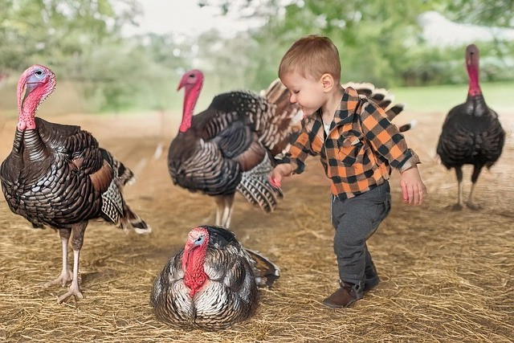
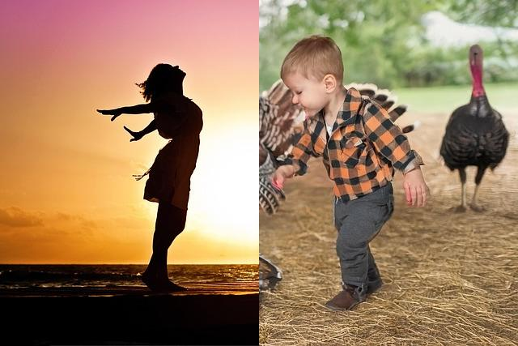

# 08 Activity: Media Computation lab

## Solving Problems Using Loops

### Combine Pictures

Here's a short program that combines half of one picture side-by-side with half of another:

```python
from PIL import Image;
file_name_1 = 'sunset.jpg'
file_name_2 = 'turkey.jpg'
pic_1 = Image.open(file_name_1)
pic_2 = Image.open(file_name_2)
(width1,height1) = pic_1.size
(width2,height2) = pic_2.size
if width1 != width2 or height1 != height2:
    print('Sorry, this program only works with identically sized images.')
    exit()
combo_pic = Image.new("RGB", (width1,height1))
pixels_1 = pic_1.load()
pixels_2 = pic_2.load()
pixels_combo = combo_pic.load()

for y in range(height1):
    for x in range(width1):
        if x < width1 / 2:
            (r,g,b) = pixels_1[x,y]
        else:
            (r,g,b) = pixels_2[x,y]
        pixels_combo[x,y] = (r,g,b)
combo_pic.show()
```

It only works if both pictures are the same size. To try it with different images, just change the filenames in the top lines of code.

---

> *(No challenge this week - please focus your valuable study time on your word game assignment.)*

---






> *Image credit: Pixabay user JillWellington*
