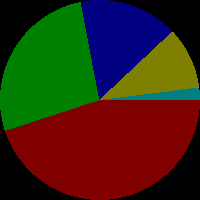

# 10 Activity: Media Computation lab

## Parallel Lists

### Drawing a Pie Chart

The program below draws a pie chart. Parallel lists hold the data used to draw the chart:

* `colors` (a different color for each pie slice)
* `percentages` (the relative size of each pie slice)

A counting loop `for i in range(len(percentages))` uses the counting index `i` to process each pair of items in the parallel lists: `percentages[i]` to access a number, and `colors[i]` to access the color associated with that number.

```python
from PIL import Image, ImageDraw
img=Image.new('RGB', (200, 200))
chart=ImageDraw.Draw(img)

# parallel lists of colors and percentages
colors = [
    (128, 0, 0),  # red
    (0, 128, 0),  # green
    (0, 0, 128),  # blue
    (128, 128, 0),  # yellow
    (0, 128, 128)  # cyan
]
percentages = [45, 27, 16, 10, 2]
if sum(percentages) != 100:
    prnt("Warning: percentages don't add up to 100.")

# convert percentages to degree angles,
#   then use those angles to draw pie slices
start_angle = 0
for i in range(len(percentages)):
    end_angle = start_angle + percentages[i] * 360 / 100
    chart.pieslice([0, 0, 199, 199], start_angle, end_angle, colors[i])
    start_angle = end_angle

img.show()
```

One of the pillow library's ImageDraw functions is `pieslice`.

* The first argument to `pieslice` is a list that specifies the corner coordinates of a "bounding box" that contains the "pie." Here, `[0, 0, 199, 199]` makes the pie fit all the way to the edges of the 200 × 200 pixel image.
* The second and third arguments are the starting and ending angles (measured in degrees) of the pie slice. Angles of pie slices add up to `360` degrees, but percentages add up to `100`, so each `end_angle` is calculated wth arithmetic to scale up a percentage to a corresponding angle size.
* The fourth argument is the `(red,green,blue)` color specification.



## Challenge

Suppose you want to highlight one specific slice of a pie chart. A simple way to focus attention is to "explode" that slice -- shift it slightly away from the rest of the chart. Write a pie chart program where **the first slice uses a different bounding box** than the others This should make that slice appear separated or pulled out from the main pie. THe remaining slices should all share the same bounding box so they stay together.
