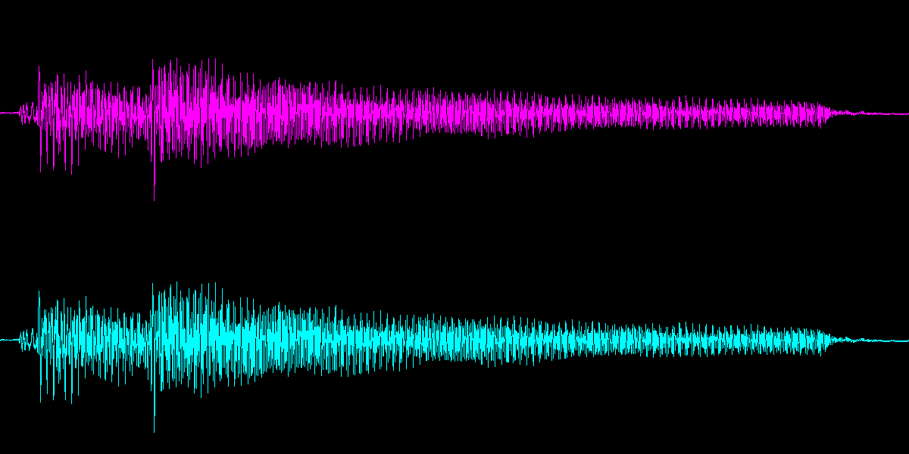

# 11 Activity: Media Computation lab

## Parallel Lists For Audio Channels From a Sound File

### Visualize a Sound Waveform

If you're using a Windows 11 computer, change the file name to
`sound_file = "/Windows/Media/tada.wav` to visualize a
different "Ta-Da!" sound.

```python
import wave
from PIL import Image, ImageDraw

# Use this CD-quality audio data WAV file (16-bit stereo PCM format):
sound_file = "ellenguitartada3.wav"

# Draw a graph of its waveform. Each sample in the audio data simulates
# an *amplitude* in a wave, representing the position of an air-pressure
# sensitive device in a microphone (recording) or speaker (playback).
# Increasing sequences of samples are compressions (pressure going
# higher). Decreasing sequences are rarefactions (pressure going lower).
# CD quality audio repositions a speaker's pressure device 44,100 times
# each second into one of 65,536 positions (-32768..+32767). Binaural
# stereo sound requires 88,200 samples per second.

# First, get the compact sound data frames ("sample bytes") from the file
audio_file = wave.open(sound_file, "rb")
frame_count = audio_file.getnframes()
sample_bytes = audio_file.readframes(frame_count)
audio_file.close()

# Build parallel lists from the raw sound sample bytes
left_samples = []  # left speaker channel's samples
right_samples = []  # right speaker channel's samples
for i in range(frame_count):  # iterate over frames (sample pairs)
    j = i * 4  # there are four bytes in each pair of samples
    sample = sample_bytes[j: j + 2]  # left sample from first two bytes
    value = int.from_bytes(sample, byteorder='little', signed=True)
    left_samples.append(value)
    sample = sample_bytes[j + 2: j + 4]  # right sample after that
    value = int.from_bytes(sample, byteorder='little', signed=True)
    right_samples.append(value)

# Graph the stereo waveforms. In this 1200 × 600 pixel image, the left
#   channel will be plotted above in rows 0-299, and the right below
#   in rows 300-599.
waveform = Image.new('RGB', (1200, 600))
canvas = ImageDraw.Draw(waveform)
x_scale = len(left_samples) // 1200  # fit duration within 1200 pixel columns
y_scale = -300 / 65536.0  # fit possible sample ranges within 300 pixel rows
for c in range(1200):  # counter for each pixel column
    i = x_scale * c  # calculate how many samples fall into that column

    # span all left samples in the column with a magenta vertical line
    extent = left_samples[i : i + x_scale]
    low_amplitude = min(extent)  # lowest sample
    high_amplitude = max(extent)  # highest sample
    low_y = 150 + low_amplitude * y_scale  # scale lowest
    high_y = 150 + high_amplitude * y_scale  # scale highest
    canvas.line([c, low_y, c, high_y], (255, 0, 255))

    # envelop all right samples in the column with a cyan vertical line
    extent = right_samples[i : i + x_scale]
    low_amplitude = min(extent)
    high_amplitude = max(extent)
    low_y = 450 + low_amplitude * y_scale
    high_y = 450 + high_amplitude * y_scale
    canvas.line([c, low_y, c, high_y], (0, 255, 255))

waveform.show()
```

<audio controls src="ellenguitartada3.wav" type="audio/wav" title="ellenguitartada3.wav"></audio>

(Download audio file: [ellenguitartada3.wav](ellenguitartada3.wav))



> *Audio: EllenGuitarTada3.wav by actsofpaint -- [https://freesound.org/s/371086/](https://freesound.org/s/371086/) -- CC license: Attribution 4.0*
